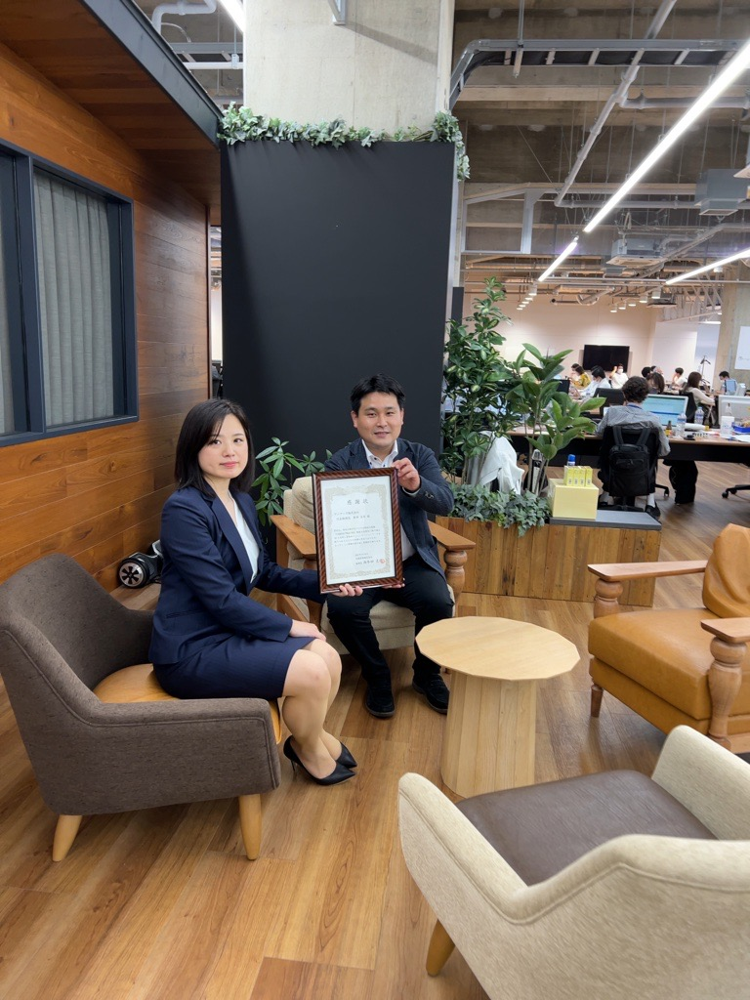

# Otsuka Warehouse Co.,Ltd. Contact easily from a variety of venues with the "Inquiry multi-chat function".

## Overview
One of the goals of the first phase of Otsuka Warehouse Co.,Ltd.'s "Creation of the most used IT infrastructure in the logistics industry" is to "eliminate call center telephone support. In order to achieve on-site completion from receiving to shipping through system integration using terminals, reducing the number of phone calls was a major theme.

Otsuka Warehouse Co.,Ltd. delivers not only food products, beverages, pharmaceuticals, and daily necessities handled by the company group. The company has established a "common platform" that allows for the collective delivery of other companies' products as long as the delivery destination is the same, so it receives many inquiries from external customers.

Therefore, we decided to centralize the management of inquiries by including a "multi-chat function" within CARGO TRACKS. By digitizing internal and external communications, all interactions are stored as logs, and we have introduced a groundbreaking attempt to link Teams and LINE to create a system that allows easy confirmation and replies from PCs and smartphones. In addition, since the date, time, period, and the person in charge are also known, the aim was to prevent omissions of replies and the absence of the person in charge.



## Background of Application
When we first decided to introduce CARGO TRACKS, we envisioned it as a dedicated "delivery visualization" system. However, in the process of creating the requirement definition, Andaze's development team realized that business communication by phone or email was complicated, and there was a risk of missing important communications and "said-or-not-said" situations. In addition, the fact that some staff members, such as drivers in the car, had limited means of easily contacting the company, was also affecting responses to inquiries.

Therefore, we suggested that a system that could collectively manage interactions on the Web by adding a multi-chat function and record them as logs might be necessary. At the time, Otsuka Warehouse Co.,Ltd. had already begun using Teams as a communication tool within the company, and the timing was right for them to experience the convenience of the multi-chat function. The company realized that a UI that could be easily written from a smartphone application or PC, which all internal and external personnel use on a daily basis, would be an important mechanism for Otsuka Warehouse Co.,Ltd. to meet its needs.



## Results obtained
(1) It would take a lot of time and effort to get all delivery drivers who only use their smartphones to download a new chat application, and some drivers would find it difficult to master the functions. Therefore, Andaze pioneered the integration of LINE and Teams. Otsuka Warehouse Co.,Ltd. and manufacturer representatives communicate with each other on CARGO TRACKS and Teams, while drivers can now check and reply to messages using LINE, which was originally included in their smartphones. This groundbreaking linkage has led to improved convenience in that people active in their respective fields can easily communicate with each other anytime, anywhere.

(2) When, who, what kind of inquiry was received, who confirmed it with whom, and how it was returned. A series of inquiries are all recorded. Currently, the person in charge handles the inquiries, but in the future, plans are underway to utilize the data accumulated in the system to automate chat replies like a "chatbot".

(3) Multiple chat rooms can be created for a single inquiry. Even if the subject matter is the same, the chat rooms can be divided according to the members of the group with whom the user is conversing.

(4) By completing communication through chat rooms, data on the types and trends of inquiries can be accumulated. Later, the content can be analyzed for further business improvement and customer satisfaction.

By consolidating inquiries into chat, the burden on the office is eliminated. Teleworking is made possible by reducing the number of phone calls, faxes, and other tasks that require coming to the office, creating an environment that can adapt to social conditions such as the Corona disaster. Currently, the system is used only within the company, but training will be provided to partner companies in the future, and gradually a system will be established to enable conversations with business partners over chat. Otsuka Warehouse Co.,Ltd. is taking steps toward complete digitalization, saying, "Otsuka Warehouse Co.,Ltd. does not use the telephone. In the future, we plan to build a system that enables web ordering, delivery visualization, and multi-chat functions to be completed with a single login.



## Customer Information
Otsuka Warehouse Co.,Ltd.

1-3-16 Ishida, Minato-ku, Osaka-shi, Osaka

https://www.otsukawh.co.jp/