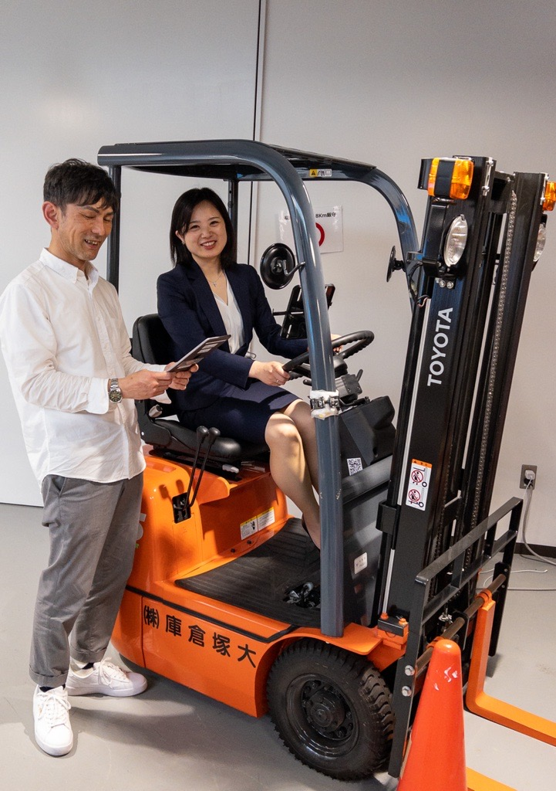

# Otsuka Warehouse Co.,Ltd.: "Delivery visualization" shows the health of logistics.

# Overview
Otsuka Warehouse Co.,Ltd. provides the logistics infrastructure for products essential to our daily lives, from pharmaceuticals such as intravenous drips and medicines to beverages and daily necessities. Otsuka Warehouse Co.,Ltd. is not limited to Otsuka Holdings Group products, but also promotes joint distribution by utilizing its nationwide next-day delivery logistics network and handling more than 60% of products sold externally as a common platform. The Otsuka Warehouse Co.,Ltd. is committed to "IT x Logistics".
Otsuka Warehouse Co.,Ltd. is committed to "IT x Logistics". The warehouse is positioned as a "TECH-BASE" and is working on various digitalization projects and developments to solve issues in the logistics industry.

To begin with, most of the logistics industry requires "paper" information to move goods. For example, orders received by fax were manually entered. Inventory allocations are made, and the storage locations are searched and products are found according to paper lists. Slips are printed one by one according to a manufacturer-specific format. Data is only used for Excel input for each manufacturer, and human labor was essential for the entire process. To solve this problem, Otsuka Warehouse Co.,Ltd. has implemented ID transportation, which automatically enables web-based ordering, picking, and instructions to shipping companies, as well as paperless delivery slips. The company succeeded in drastically reducing internal administrative work, and was awarded the Logistics Grand Prize by the Japan Logistics Systems Association.

The first phase of Otsuka Warehouse Co.,Ltd.'s IT x logistics initiative is "visualization of delivery status. The "visualization of delivery" is a function of CARGO TRACKS, a system that allows users to check the status of orders from receipt to delivery on the screen. The system allows the user to grasp in real time the location of the package, its route, estimated time of arrival, and even the temperature and humidity inside the delivery vehicle on the map on the screen.



## Background of Application
For wholesalers and manufacturers, being unable to "see" the delivery status easily leads to anxiety, and in the past they were inundated with inquiries by phone and e-mail. However, when delivery operations are outsourced to a shipping company, it is sometimes difficult to contact the driver directly. The delivery company would contact the office of the delivery company, which would then contact the driver and wait for the driver to return the call, resulting in cases where the delivery had already been made by the time the inquiry was responded to. In particular, when a disaster or accident occurs, the call center is often inundated with inquiries and confirmations from within the company as well as from the call center, resulting in cost and workload issues. Therefore, we built a common platform that allows employees and partners nationwide, as well as customers at the delivery site, to retrieve necessary information more easily.



## Results obtained
Shortly after the introduction of the system, there was a day when an earthquake occurred in the Tohoku region. When an earthquake occurs, there are delays in deliveries depending on the situation. In the past, when a disaster occurred, we had to create shipping data for each manufacturer in Excel, add delivery and delivery status, and email it to them. This time, however, the Sendai Sales Office, which has jurisdiction over the Tohoku region, made full use of CARGO TRACKS' "delivery visualization" function. By taking delivery completion logs frequently, the Logistics Division, the operational unit, was able to check the delivery status in real time and communicate it to the manufacturer with outstanding response. As a result, the time and effort required for customers to wait for a response to their inquiries was greatly reduced. The customer's anxiety about not knowing when the package will be delivered has been eliminated. In the future, Otsuka plans to build a system that will allow partner companies to check the status of their shipments on the screen as well.
The "delivery visualization" system is a mechanism for showing the "health status" of Otsuka Warehouse Co.,Ltd.'s logistics operations. In times of emergency, when breaking news is needed, this information is useful not only to the company itself, but also to the wholesalers and manufacturers to whom deliveries are made. This kind of "connected logistics" that further enhances the added value of logistics can be said to be a service that can lead to competitive advantage.



## Customer Information
Otsuka Warehouse Co.,Ltd.  

1-3-16 Ishida, Minato-ku, Osaka-shi, Osaka 
 
https://www.otsukawh.co.jp/
