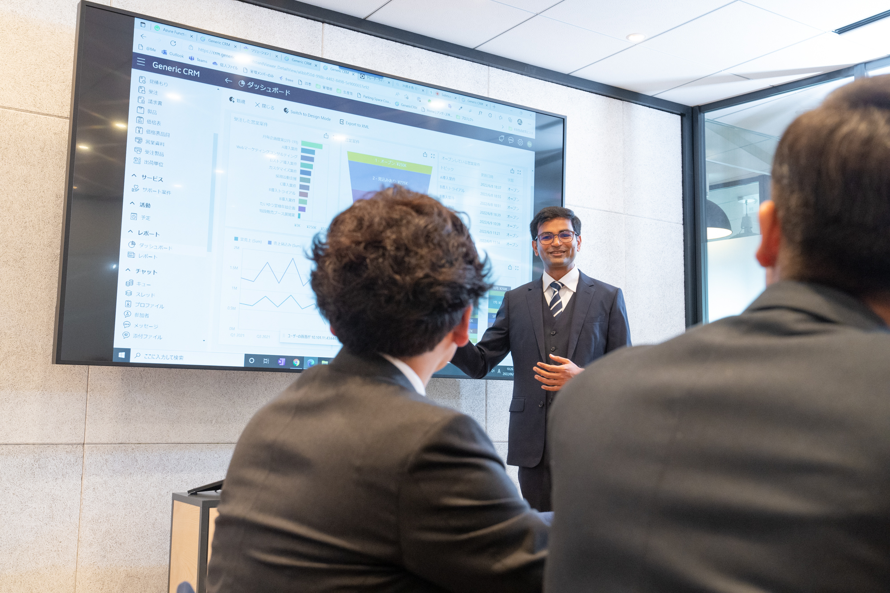

<h1 class="text-4xl font-bold mb-8">Reasons to choose us.</h1>

<h2 class="text-2xl font-bold mt-12 mb-6">Working as one, we complete projects that give you a competitive advantage.</h2>
Andaze is chosen by our clients because we are responsible for all processes from strategy to operation and maintenance.   

We are able to provide one-stop solutions, taking responsibility for all processes from strategy to operation and maintenance.   

And by utilizing the highly versatile libraries accumulated by our shared team, we are able to increase development efficiency and focus on development that leads to essential competitive advantages.  

We are able to lead and complete projects at a speed that only a venture company can provide.   

We will produce results that exceed your expectations without exceeding your budget.   

  

<h3 class="text-xl font-bold mb-6">We take responsibility for the entire process and are fully committed to the success of your business.<h3>
The initial plan was good, but it did not produce the desired results. 
The system is complicated, difficult to use, and does not take root. 
Additional costs were incurred during the project process, resulting in huge costs. 
These are some of the common cases we hear about when implementing a system.  

At Andaze, our team members who have experience in new business strategy work from the top-level consulting process, so your strategy will never end up as "Pie in the sky".  

And since Andaz is responsible for the downstream operations and maintenance, we are able to grasp changes in the business in an ongoing manner.  

Another of our strengths is the speed of development that can only be achieved by a venture company with a mindset of change.  

This is an environment where you can complete services that give you a competitive advantage with global standard technology at a reasonable price.  

We will continue to accompany you with full commitment as a technology partner.  

  

<h3 class="text-xl font-bold mb-6">One-stop service from strategic planning to operation and maintenance.</h3>
We want to consult with you on everything from the strategy phase to the operational phase.   
It is difficult to assign different responsibilities to different systems and processes.  
We want to focus on the product rather than sticking to the original plan. 
These requests and concerns may arise after the request has been made.  

Andaze provides a shared team of professionals in each field who handle everything from strategy to operation and maintenance.  

Sometimes, the team that developed the strategy is also responsible for the downstream operations and maintenance.  

In order to provide high value-added services with a high level of consistency, we are committed to accepting prime orders and do not subcontract work to subcontractors.  

We do not work on legacy projects, but rather on technologies that are future-proof and of global standards.  

This is why our shared team is always highly motivated.  

Of course, we don't stop when the product is ready; we continue to work as one team to provide the best possible environment.  

Consistency is a prerequisite for high value-added services.  

  

<h3 class="text-xl font-bold mb-6">We provide value-added competitive advantage through our versatile libraries.</h3>
Consulting firms don't commit to development. 
Systems companies lack business understanding.  
Outsourcing strategy and system development is expensive. 
It is often the case that the client does not get the results they are looking for due to these reasons.  

Andaz has accumulated a highly versatile library that can solve your problems.   
In addition, we have a robust security environment.  

And we can provide the best solutions at the right price because we can concentrate on developing value-added products that give us a competitive advantage.

   

 

<h2 class="text-2xl font-bold mt-12 mb-6">Services offered by Andaze</h2>
From strategic planning to design, development, operation and maintenance, we have a team of professionals who know your business and technology inside and out. We continue to create and refine services that maximize our clients' business value.    

<h3 class="text-xl font-bold mb-6">Strategy/DX Consulting</h3>
Andaze deploys advanced solutions. We make proposals that solve our clients' problems while incorporating superior technologies and seasonal industry trends. We are attentive, persistent, and use collaboration and expertise. We provide thorough support so that our clients can utilize the best solutions.   

<h3 class="text-xl font-bold mb-6">Systems Consulting</h3>
Our shared team, with a deep understanding of your business, designs a system based on your IT strategy from a management perspective. We propose the best requirement definition from a professional point of view, rather than a one-way communication like a top-down approach. As a Microsoft Gold Partner, let us share our ideas to maximize your business value using superior technology.   

<h3 class="text-xl font-bold mb-6">System Development</h3>
A shared team that has worked on strategic planning and systems consulting will begin development. We don't just stick to the original plan; we make modifications as often as possible, responding to changes in your situation and feedback as appropriate. Through repeated prototyping and refinement, we are able to develop high-quality systems with short turnaround times. We draw out the customer's latent needs and provide high value-added products that take advantage of our strength as a Microsoft Gold Partner.   

<h3 class="text-xl font-bold mb-6">Operation and Maintenance</h3>
After implementation, our shared team, which is involved in the entire process from consulting to development, provides long-term support, including 24/7/365 system operation monitoring and recovery support in case of trouble. We also make proposals for future-oriented system improvements and other measures that will lead to a successful DX implementation, with a focus on achieving the goals of the project.   

<h3 class="text-xl font-bold mb-6">Recruitment Agency Services</h3>
Recruiting" methods and services are diversifying these days. On the other hand, many companies may find that recruiting has become a low-priority "work in progress. At Andaze, we provide one-stop support for the entire recruitment process, starting from the stage when the target "how many of these people we want to hire" is decided. We use digital technology to "visualize" the most appropriate media and methods based on experience, age, number of people, time frame, and cost. We can also outsource time-consuming tasks such as creating scout emails and scheduling. After the recruiting process, we can analyze the entire process and make suggestions for improvements to enhance the quality of the recruitment process.

   

 

<h2 class="text-2xl font-bold mt-12 mb-6">Certification, Accreditation, Corporate Licensure, (Member Organization/Partner)</h2>
In order to improve our organizational capabilities, we have acquired certifications, accreditations, and corporate licenses in various areas, including Microsoft.
<ul class="ml-6 mt-6 list-disc">
<li class="mb-2">Microsoft Gold</li>
<li class="mb-2">ISO27001</li>
<li class="mb-2">ISO9001</li>
<li class="mb-2">IT introduction subsidy eligible service</li>
<li class="mb-2">Licensed as a fee-charging employment agency</li>
<li class="mb-2">Telework Master</li>
<li>Declaration of Partnership Building</li>
</ul>