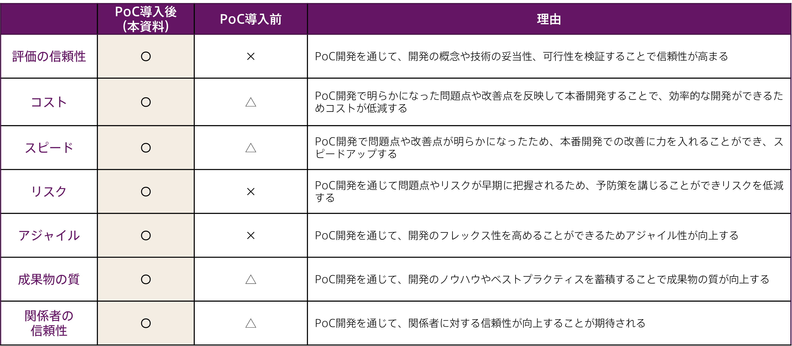

## システム開発の実現可能性を確認し、投資判断をするための「試作・実装・検証」をご提供

DXの成功の第一歩はPoCです。PoC（ピーオーシーまたはポック）とは「Proof of Concept」の略で、システム開発の実現可能性を見出すため、実際に小規模な試作や実装を行い、できあがったもので検証を重ね、IT投資を行うかどうかの判断をするためのものです。PoCで検証された結果をしっかりと分析し、本番環境で効果を実証・不具合の検証を継続していくことが、プロジェクト達成の近道となります。

アンダーズでは、新システムの導入やセキュリティ構築を検討されている企業様のPoCを承っています。IoTやAIを開発する場合、前例のない施策や技術を活用して多額の投資を行うことが多いため、本格的な開発をしてから結果が得られないと、損失が大きくなります。そのため、まずはシステムの簡易版を作成し、小規模な検証を行うことで、早い段階で実現可能かどうか、投資額に見合った効果が生み出せるか、検証していただくことができます。すでにアイデアや技術的な実現性が確定したシステムのプロトタイプ・試作品製作も承っていますので、ぜひご相談ください。

## 7つの視点でみるPoC開発前後の変化

新システムの開発では多額の投資を行うため、開発後に結果が得られないと損失が大きくなります。そのため、まずは簡易版を作成し検証することで、早い段階で実現可能か投資額に見合った効果が生み出せるか検証します。

## カスタムPoCサービス8つのメリット

カスタムPOCはニーズを正確に捉え、最適なシステムを提案するため、DX推進に必要不可欠なツールです。カスタムPOCを実施することで、業務プロセスや課題を深く理解し、最適な解決策を提供することができるため、確かな信頼関係を構築することができます。

### Merit1：早期具現化
ニーズや課題を把握することで早期に最適なシステムの具現化が可能となります。そのため、開発や導入のスピードが向上し、より早いビジネス上の成果を得ることができます。

### Merit2：機能検証
要望やニーズを正確に把握した上で最適なシステムを提案し、機能の検証ができるため、システムの開発前に機能の動作確認や問題点の発見ができ、品質の向上につながります。

### Merit3：無駄な工数・コストの削減
無駄な工数をかけることなく、コストを抑えて新サービス導入を実現することができます。また、失敗やスケジュール遅れなどによる無駄な工程・コスト増も削減することが可能です。

### Merit4：早期評価
開発のオーバーヘッドを削減し、早期の評価を行い、最終的なシステムの構築を行う際に役立つ情報を収集することができます。

### Merit5：仕様確定
希望するシステムの仕様を実際に試作することができるため、仕様確定を早期に行うことができます。これにより、後の開発段階での修正・改善作業の削減や、納期の短縮が実現可能となります。

### Merit6：開発リスクの軽減
PoCを行うことで、実現可能かどうかを早期に判断できます。実際の環境を再現しながら検証するため、動作の安定性や使い勝手を確認し、リスクを軽減しながら開発できます。

### Merit7：社内の理解・フィードバック
PoCを実施し、実現性や費用対効果の根拠を示すことで、社内からの理解が得やすくなります。また現場の従業員からのフィードバックを得ることも可能で、問題点を発掘できます。

### Merit8：円滑な意思決定と投資判断
PoCを通じて、技術的問題がなく、目的に対して十分な効果や成果を示すことができれば、経営層の意思決定（投資判断）を促す材料となり、開発予算を獲得することができます。

## PoCの流れ（プロトタイプ・試作品製作は2以降）

### Step1：ゴール（目標値）設定

PoCを通して得たい結果や必要なデータが何なのか、目標値を設定します。

### Step2：試作と実装

必要最小限の機能を搭載したシステムの試作品を開発し、その後、実環境へ実装します。

### Step3：検証

実際に使用する人に、より実践に近い形でシステムを使ってもらい、効果を検証します。

### Step4：評価

PoCで得たデータをもとに評価を行います。実現可能性と共に課題も洗い出していきます。

## カスタムPoCサービス ×Microsoft Azure

Azureの機能を利用して、AI・IoT・認知機能・データ統合の小規模な開発を行い、開発の実現可能性を確認し、課題を特定します。実現性・到達レベルの検証、不確実性の排除、安全性の確認を行うことができます。実現すべき開発範囲、開発期間と概算の費用を得ることで、本番開発への投資判断を行うことができます。

### 低コスト
お客様が支払う必要のあるコストを最小限に抑えることで、コストを削減します。Azureでは、インフラストラクチャ、プラットフォーム、データベースなどのサービスのコストが最低限に抑えられています。

### データセキュリティ
高いレベルのセキュリティを提供しています。Azureは、暗号化、データ検証、2要素認証などの様々な機能を備えています。

### 豊富な機能
豊富な機能を提供しています。Azure上では、サーバーやデータベースなどを簡単に構築できたり、ストレージやデータのバックアップを行ったりすることができます。

### 簡単な管理
簡単な管理インターフェースを提供しています。お客様は、Azureポータルを使用してサービスを管理し、複雑な構成やセキュリティ設定を行うことができます。

### 自動アップグレード
Azureを使用すると、サービスの自動アップグレードにより、アプリケーションのパフォーマンスを向上させることができます。

### ハイブリッドインテグレーション
オンプレミスのデータセンターをAzureに簡単に統合できるように設計されています。お客様は、Azureを使用して、オンプレミスとクラウドを統合することができます。

## アンダーズが選ばれる3つの理由

弊社はPaaSで業務システムを構築する専門集団であり、高機能・高品質を適正価格で提供するベンダーとして幅広い業種のお客様から継続率94％で選ばれています。戦略立案から設計、開発、運用保守までをビジネスとテクノロジーを熟知したシェアードチーム®が担当し、グローバル基準の技術を活用して競争優位をもたらすサービスを提供。お客様のビジネス価値を最大限に高めるために努力を惜しみません。

### Reason1：ソリューションに関する豊富な経験とビジネスへの深い理解

* 金融・物流・不動産・製造・卸売・小売り・サービスの業種において、クラウドソリューションで培った豊富なノウハウが強みです

* マーケティング・営業・総務・経理・人事・業務・資材・サービス部門におけるプロセスに精通しています

* クラウド利用料を最適化して、システムへの投資対効果を確実なものとします

### Reason2：既存システム拡張から新規事業参入まで対応できる技術力

* 第三のCRM®ライブラリーの蓄積により、SaaSレベルの品質とスピード開発を可能とします

* 分類・回帰・予測といったAI計算に加えて、音声・画像・動画・文字を分析し、人の意思決定をシステムで代替します

* マイページ、マルチテナント、独自SaaSサービスなど、高い設計技術を要する案件もお任せください

### Reason3：運用まで自社完結のワンストップでサービスをご提供

* 品質管理（ISO27001）、セキュリティ管理（ISO9001）認証のプロセスで、安心の運用サービスをご提供します 

* 設計をしたシェアードチーム®がワンストップで運用まで手がけますので、システムが絵にかいた餅になりません 

*  DXやIT戦略について何でも相談できる強力なパートナーシップを築き、長期的に柔軟に対応しています

## シェアードチーム®について

正社員を雇うこともできますが、最近はシェアードチーム®︎を選択する企業が増えています。シェアードチーム®という選択があることで、企業様は、より柔軟な雇用形態を採用できるようになり、業務効率が飛躍的に上がります。

**※準委任契約とは：** 専門的な知識や経験を持つ人が、発注者から指揮命令を受けずに仕事を請負い、自分の責任で仕事を遂行する契約です。

### Reason1：直接雇用のリスクを回避

企業が長期雇用したスタッフが退職すると、システムの知識を失うリスクがあります。弊社のシェアードチーム®は、異なる企業にローテーションすることで、業務の属人化を防ぎます。また、弊社に長期で関わっていただくと、弊社の様々なプロフェッショナルがご支援するため、1社で採用できる人材数を大幅に増やすことができます。

### Reason2：時間あたりの生産性の向上

全社員が得たノウハウや人脈を社内で共有しているため、お客様の課題にマッチした経験を持つシェアードチーム®が業務に取り組みます。そのため、事例調査や外注先探しの時間が短縮され、様々なリスクも低減できます。第三者としての客観的な提案をさせていただくことで、お客様社内での意思決定時間の短縮も可能となります。

### Reason3：人材の増減や交代が自由

情報システム部門の業務は、日々変動しており、システム運用やヘルプデスクなどの業務量やスキルレベルが常に変わります。弊社のシェアードチーム®は、専門家チームで構成されており、お客様のビジネスの変化に応じて必要な人員を自由に調整できるため、お客様の企業に必要な情報システム人材を社内メンバーとして利用が可能です。

## アーキテクチャサンプル（大規模）

## アーキテクチャサンプル（小規模）

