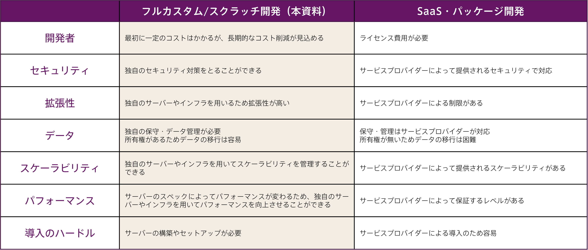

## 投資対効果の高いアプリケーション開発を実現

スクラッチアプリケーション開発は企業の業務フローや手順に合わせて、アプリケーションをゼロからオーダーメイドで構築する方式です。SaaSやパッケージ製品のカスタマイズと比べて自由度が高く、独自のアプリケーションを開発できるというメリットがあります。

## フルカスタム/スクラッチ開発10のメリット

自社業務に最適なアプリケーションをオーダーメイドで構築できるため、ユーザーに違和感なく使いやすく、一度導入すればランニングコストも低く抑えられます。業務拡大や改善にも柔軟に対応でき、最適なソリューションを提供できることが大きなメリットです。

### Merit1：自由に開発できる

SaaSやパッケージでは実現できない、自社の目的に合った機能や仕様のアプリケーションを開発することができる。

【開発例】

自社の業務フローや手順に最適化された、課題解決に役立つアプリケーション、厳格なセキュリティやコンプライアンスの要件を満たしたアプリケーション、独自色の強い新規事業・サービス関連のアプリケーション　など

### Merit2：機能要件を最適化しやすい

時間と予算の制約のなかで、本当に必要としている機能に絞り込んだ開発を優先順位の高い順から、短いスパンでリリースできる。

* アジャイル開発を採用。コア機能を先に完成させて検証を重ね、機能追加しながら完成度の高いアプリケーションを開発

* 営業・受注管理、顧客管理、サービス品質管理など、利益を生み出す源泉となるアプリケーションはスクラッチ開発＆機能改善で最適化

### Merit3：将来的な拡張性が確保できる

ビジネスの成長やデータ内容・収集方法に合わせて、将来的な拡張性を見越したうえで開発できる。

* 新規事業やサービスに関するアプリケーションは必要最小限の機能でスタートし、ビジネスの状況を見ながら機能拡張

* 大容量データ（IoTで自動収集されたデータ、音声・動画・画像など）を扱うアプリケーション、AIを活用するアプリケーション、外部システム連携などは容量的に融通の利く、拡張性のあるスクラッチ開発のほうが向いている

### Merit4：長期間使えるシステムが作れる

自社にとって重要度が高く、長期間使えるアプリケーションを開発することができる。

* バージョンアップ時の改変など、メーカー都合に左右されない

* 自社専用なので、仕様や操作性、使い勝手が保証されている

* 業務フローやビジネスの変更に合わせてカスタマイズでき、既存データも移行できる

### Merit5：予算に合わせてオーダーできる

必要な機能に絞ったアプリケーション設計をすることで、予算に合わせた開発が可能。

* 汎用言語によるローコード開発で、人員確保や育成、開発に伴う手間や工数も少なくて済む

### Merit6：トラブルを解決しやすい

自社開発なので、トラブルや障害が起きても原因究明がしやすく、問題解決までのスピードを早めることができる。

* SaaSやパッケージの場合、製品自体に問題が起きてもシステムの深部に触れられないが、そうしたデメリットがない

### Merit7：他社との差別化を図りやすい

オーダーメイドで開発を行うため、独自性の強いアプリケーションを開発することができる。

* 新規事業や新しいサービスを立ち上げる際、SaaSやパッケージでは実現できない機能を搭載した、オリジナルアプリケーションで勝負することが可能

### Merit8：開発予算を有効に使える

必要最低限の機能のみを開発できるので、開発予算に抑えることができる。

* SaaSやパッケージのカスタマイズと違い、自社に必要な機能だけを実装したアプリケーションを開発できるため、不必要な開発コストを削ることが可能

* ライセンス料などが不要なので、ランニングコストも削減可能

### Merit9：望む機能が開発可能なので、顧客も開発者もストレスが少ない

制限なく、希望通りの機能を提案・開発することができるので、企業側・開発側双方にストレスが少ない。 

* SaaSやパッケージの元の仕様の制限を受けることなく、ゼロから最善のアプリケーションを開発することができる

### Merit10：システムとしての統一感を持たせられる

UI/UXデザインを自由自在にカスタマイズできるので、アプリケーションごとの見た目や操作性を統一できる。

* 従前のアプリケーションと似たデザイン・操作性にすることも可能。違和感がなく、従業員が習熟しやすい

* 顧客管理システムなど、他のシステムとの連携もスムーズ

## フルカスタム/スクラッチ開発 × Microsoft Azure

Azureはスクラッチアプリケーション開発を簡単にする機能が揃ったクラウドプラットフォームです。アプリケーションの開発、テスト、デプロイ、管理に必要なクラウドサービスを統合しているだけでなく、クラウドコンピューティングの効率性も利用しており、お客様の需要の増大に合わせて規模を拡張することができます。

### 少ないコードでアプリケーションを作成

Azureと弊社蓄積の汎用ライブラリーを使用し、ローコードでより迅速にアプリケーションを開発します。すぐに使用できるコネクターや、一般的なユースケース用の組み込みソリューションを使用して、ビジネスプロセスを自動化します。

### コードをサーバーレスで実行

Azure上でコードをサーバーレスで実行できるAppServiceを使用し、プログラムのビルド・変更への迅速な対応、スケーリングと拡張、バッチ処理、パフォーマンスの可視化、ログデータの収集などを行います。 APIやWebサービスの効率的な作成も可能です。

### アプリケーションの効率的な共同開発が可能

アプリケーションの共同開発ができるGitHubを使い、クラウド上で効率的に作業を行い、迅速にリリースします。アジャイル開発向けツールや作業工程の自動化機能を利用して、開発の効率化や省力化、本番環境への迅速な反映を図ります。

## アンダーズが選ばれる3つの理由

弊社はPaaSで業務システムを構築する専門集団であり、高機能・高品質を適正価格で提供するベンダーとして幅広い業種のお客様から継続率94％で選ばれています。戦略立案から設計、開発、運用保守までをビジネスとテクノロジーを熟知したシェアードチーム®が担当し、グローバル基準の技術を活用して競争優位をもたらすサービスを提供。お客様のビジネス価値を最大限に高めるために努力を惜しみません。

### Reason1：ソリューションに関する豊富な経験とビジネスへの深い理解

* 金融・物流・不動産・製造・卸売・小売り・サービスの業種において、クラウドソリューションで培った豊富なノウハウが強みです

* マーケティング・営業・総務・経理・人事・業務・資材・サービス部門におけるプロセスに精通しています

* クラウド利用料を最適化して、システムへの投資対効果を確実なものとします

### Reason2：既存システム拡張から新規事業参入まで対応できる技術力

* 第三のCRM®ライブラリーの蓄積により、SaaSレベルの品質とスピード開発を可能とします

* 分類・回帰・予測といったAI計算に加えて、音声・画像・動画・文字を分析し、人の意思決定をシステムで代替します

* マイページ、マルチテナント、独自SaaSサービスなど、高い設計技術を要する案件もお任せください

### Reason3：運用まで自社完結のワンストップでサービスをご提供

* 品質管理（ISO27001）、セキュリティ管理（ISO9001）認証のプロセスで、安心の運用サービスをご提供します 

* 設計をしたシェアードチーム®がワンストップで運用まで手がけますので、システムが絵にかいた餅になりません 

*  DXやIT戦略について何でも相談できる強力なパートナーシップを築き、長期的に柔軟に対応しています

## シェアードチーム®について

正社員を雇うこともできますが、最近はシェアードチーム®︎を選択する企業が増えています。シェアードチーム®という選択があることで、企業様は、より柔軟な雇用形態を採用できるようになり、業務効率が飛躍的に上がります。

**※準委任契約とは：** 専門的な知識や経験を持つ人が、発注者から指揮命令を受けずに仕事を請負い、自分の責任で仕事を遂行する契約です。

### Reason1：直接雇用のリスクを回避

企業が長期雇用したスタッフが退職すると、システムの知識を失うリスクがあります。弊社のシェアードチーム®は、異なる企業にローテーションすることで、業務の属人化を防ぎます。また、弊社に長期で関わっていただくと、弊社の様々なプロフェッショナルがご支援するため、1社で採用できる人材数を大幅に増やすことができます。

### Reason2：時間あたりの生産性の向上

全社員が得たノウハウや人脈を社内で共有しているため、お客様の課題にマッチした経験を持つシェアードチーム®が業務に取り組みます。そのため、事例調査や外注先探しの時間が短縮され、様々なリスクも低減できます。第三者としての客観的な提案をさせていただくことで、お客様社内での意思決定時間の短縮も可能となります。

### Reason3：人材の増減や交代が自由

情報システム部門の業務は、日々変動しており、システム運用やヘルプデスクなどの業務量やスキルレベルが常に変わります。弊社のシェアードチーム®は、専門家チームで構成されており、お客様のビジネスの変化に応じて必要な人員を自由に調整できるため、お客様の企業に必要な情報システム人材を社内メンバーとして利用が可能です。

## アーキテクチャサンプル（大規模）

## アーキテクチャサンプル（小規模）

