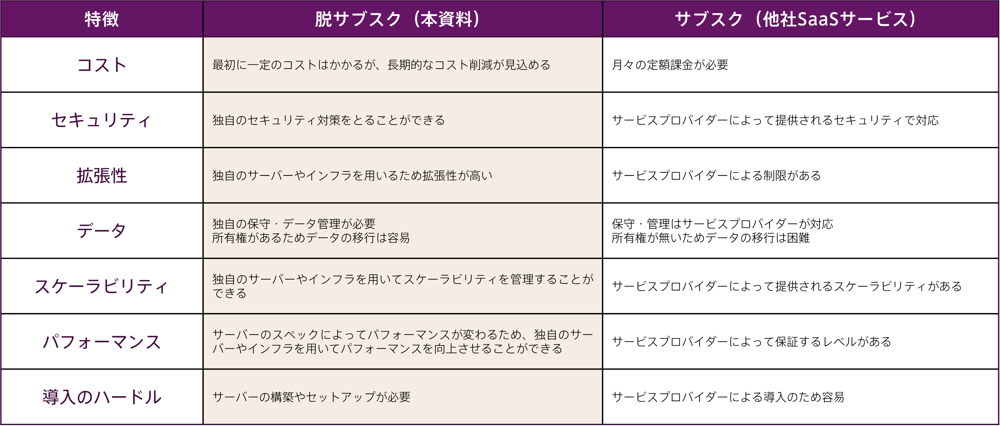
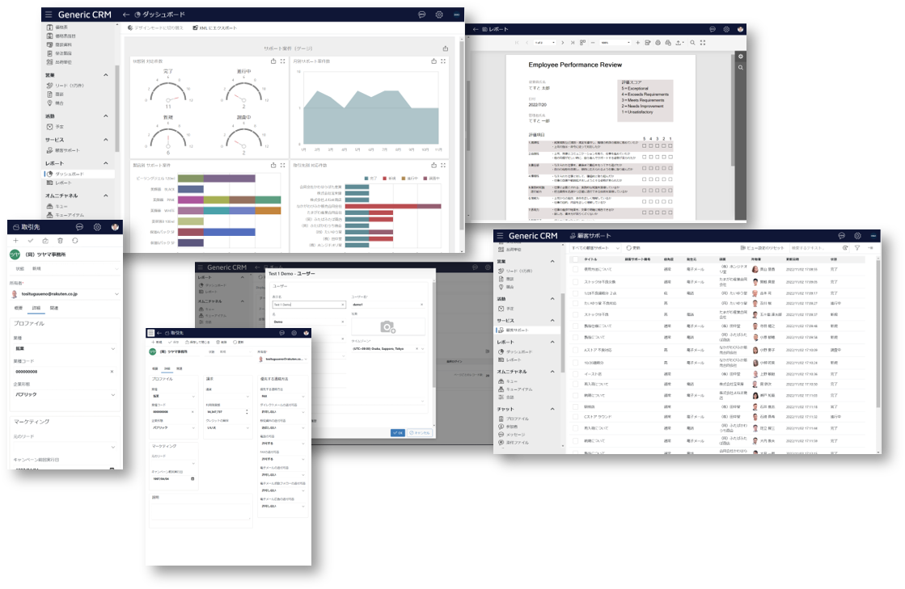

## コスト、セキュリティ、システム運用の観点から「脱サブスク・脱クラウド・脱パッケージ」をご支援

今や企業にとって欠かせない存在になったクラウドサービス（SaaS）には、運用管理の効率化などさまざまな利点がありますが、このところSaaSのサブスク料ほか関連コストが予想より高いことに気付いた企業が、ROI（投資利益率）改善のために契約を見直すなど「脱サブスク・脱クラウド・脱パッケージ」の動きが出てきています。さらにシステム運用の限界から、自社内システム「オンプレミス」のよさを再評価し、その運用を肯定的に捉える企業も増えています。

アンダーズではそんな「脱サブスク・脱クラウド・脱パッケージ」を希望される企業のご支援をいたします。コスト、セキュリティ、パフォーマンスなどのお悩みやカスタマイズの有無などをお伺いし、お客様にとって最適な形での「脱サブスク・脱クラウド・脱パッケージ（脱SaaS）」を進めていきます。

## 一般的な脱クラウド vs アンダーズの脱クラウド

### 一般的な脱クラウド

・SaaSで構築したシステムをオンプレミスに移行する

・オンプレミスからSaaSに移行したシステムを、再びオンプレミスに戻す

### アンダーズの脱クラウド

・アプリケーションごとに判断して「ハイブリッドクラウド」の形に変えていく

アンダーズの脱サブスク・脱クラウド・脱パッケージはワークロード（アプリケーション）ごとに判断して行います。すべてをオンプレミスに移行するのではなく、コスト、セキュリティ、カスタマイズ、システム連携などを考えて、必要なSaaSは残す、独自のカスタマイズや高いセキュリティ要件が求められるシステムはオンプレミスに移行する、というように柔軟に対応していきます。ただし、オンプレミスは従来型のものではなく、PaaS内のリソースを1社で専有利用する「プライベートクラウド（リソース専有型クラウド）」で、パブリッククラウドであるSaaSとプライベートクラウドであるオンプレミスクラウドとを併用して「ハイブリッドクラウド」を構築し、運用していきます。

## 脱サブスクとサブスクの違い

今や企業にとって欠かせないSaaSには、手軽に使い始められるなどさまざまな利点があります。しかし、ランニングコストやカスタマイズ、拡張性の観点から課題もあるため、PaaS内に自社システムを構築してSaaSを移行し、運用していきます。

## 「ハイブリッドクラウド」を使った脱サブスク・脱クラウド・脱パッケージ

PaaS内オンプレミスクラウドでは、オンプレミスとSaaSの間を移動できるワークロード設計をしたうえで新たなシステムを構築し、従来の基幹系システムの機密性の高いデータを連携、必要なSaaSについてのみ継続利用していきます。

## 脱サブスクの5つのメリット

使用頻度の低いサービスを整理して脱サブスクを行うことで月々の料金が削減され、コスト効率の良い経営が実現できます。PaaSに新システムを構築して移行させたり、継続使用が必要なSaaSと共存共栄させることで、個人情報の保護やプライバシーの担保も期待でき、以下のメリットが生まれます。

### Merit1：コスト削減
SaaSを利用すると年額または月額のサブスクリプション料金がかかりますが、不要なサービスを整理し、PaaSに移行することで、コスト削減を実現することができます。またPaaSに自社ソリューションを構築することで、より柔軟なカスタマイズや新しい機能・技術の採用が可能となり、ビジネスの成長に寄与することができます。

### Merit2：カスタマイズ性
SaaSは一般的に仕様やインターフェイスが決まっていますが、PaaSに移行することで機能制限がなくなり、より柔軟な独自のカスタマイズが可能になります。またPaaSで自社ソリューションを開発することで、独自開発による新しい機能や技術の採用が可能となり、自社のビジネスニーズに合ったシステムを作ることができます。

### Merit3：拡張性
必要に応じて必要なだけ、システムを拡張することができます。自社ソリューションを開発することで、将来、事業規模やビジネスニーズが変化しても、システムを拡張して対応することができます。脱サブスクにより、ビジネスの成長に合わせた拡張性や自由な開発が可能となり、企業の成長に寄与することができます。

### Merit4：セキュリティ
SaaSをPaaSに統合し、自社のインフラストラクチャでサービスを提供することで、自社のセキュリティ要件に合わせて対策を強化することができます。また、PaaS内にデータを保管することで、データのプライバシーやセキュリティ、情報保護に対するコントロールが向上し、ビジネスデータを安全に保護することができます。

### Merit5：独自のインフラ構築
PaaSを利用することで、独自のインフラを構築することができます。これによって、企業にとって有用な仕組みを確立することができるようになります。また、コスト削減や必要に応じたカスタマイズ、自社内でのより柔軟な運用が可能となり、独自インフラ構築における数々のメリットを享受することができます。

## 脱サブスク × Microsoft Azure

 

Microsoft Azureは、クラウドにてアプリケーションを実行するためのインフラを提供し、必要な設備や環境も備えます。AzureのPaaSを調達することで、コストを削減するだけでなく、「融通の利く」システムが構築できます。

### Azure Data Factory
大量のデータを統合、加工、保管することができるデータ管理プラットフォームです。分散型データストレージ、データウェアハウスなど、さまざまなデータソースからデータを統合し、ビジネスに有用な情報を提供することができます。

### Azure Storage
大量データを保存・管理するためのストレージサービスです。Blob Storageなど様々なタイプのストレージが提供されており、高い可用性、スケーラビリティ、セキュリティなどが備わっています。APIを利用して他のサービスやアプリケーションと簡単に連携することができます。

### SQL Server
PaaS向けのリレーショナルデータベース管理システムです。大量のデータを管理、高速に検索することができます。多様なアプリケーションやサービスと連携することができ、強力なデータセキュリティと高可用性が提供されています。

### Azure App Service
Webアプリ、モバイルアプリ、APIなどを条件に合わせて、手軽にホスト・デプロイすることができるサービスです。高いスケーラビリティと可用性、厳重なセキュリティ、信頼性などが備わっており、Azureの他のサービスとの統合も簡単に行えます。

### Azure Cognitive Services
人工知能を利用して画像認識、言語理解、情報抽出などの機能を提供するAPI集です。開発者はAPIを呼び出すことで、簡単にAI技術を活用することができます。APIは常に進化しており、最新のAI技術を使うことができます。

### Azure Bot Service
チャットボットを簡単に開発・デプロイできるサービス。自然言語処理、画像認識、Q&AなどのBotテクノロジーを活用し、顧客やユーザーとのコミュニケーションを効率化できます。他のプラットフォームと連携でき、顧客サポートやマーケティングなどで活用できます。

## アンダーズが選ばれる3つの理由

弊社はPaaSで業務システムを構築する専門集団であり、高機能・高品質を適正価格で提供するベンダーとして幅広い業種のお客様から継続率94％で選ばれています。戦略立案から設計、開発、運用保守までをビジネスとテクノロジーを熟知したシェアードチーム®が担当し、グローバル基準の技術を活用して競争優位をもたらすサービスを提供。お客様のビジネス価値を最大限に高めるために努力を惜しみません。

### Reason1：ソリューションに関する豊富な経験とビジネスへの深い理解

* 金融・物流・不動産・製造・卸売・小売り・サービスの業種において、クラウドソリューションで培った豊富なノウハウが強みです

* マーケティング・営業・総務・経理・人事・業務・資材・サービス部門におけるプロセスに精通しています

* クラウド利用料を最適化して、システムへの投資対効果を確実なものとします

### Reason2：既存システム拡張から新規事業参入まで対応できる技術力

* 第三のCRM®ライブラリーの蓄積により、SaaSレベルの品質とスピード開発を可能とします

* 分類・回帰・予測といったAI計算に加えて、音声・画像・動画・文字を分析し、人の意思決定をシステムで代替します

* マイページ、マルチテナント、独自SaaSサービスなど、高い設計技術を要する案件もお任せください

### Reason3：運用まで自社完結のワンストップでサービスをご提供

* 品質管理（ISO27001）、セキュリティ管理（ISO9001）認証のプロセスで、安心の運用サービスをご提供します 

* 設計をしたシェアードチーム®がワンストップで運用まで手がけますので、システムが絵にかいた餅になりません 

*  DXやIT戦略について何でも相談できる強力なパートナーシップを築き、長期的に柔軟に対応しています

## シェアードチーム®について

正社員を雇うこともできますが、最近はシェアードチーム®︎を選択する企業が増えています。シェアードチーム®という選択があることで、企業様は、より柔軟な雇用形態を採用できるようになり、業務効率が飛躍的に上がります。

**※準委任契約とは：** 専門的な知識や経験を持つ人が、発注者から指揮命令を受けずに仕事を請負い、自分の責任で仕事を遂行する契約です。

### Reason1：直接雇用のリスクを回避

企業が長期雇用したスタッフが退職すると、システムの知識を失うリスクがあります。弊社のシェアードチーム®は、異なる企業にローテーションすることで、業務の属人化を防ぎます。また、弊社に長期で関わっていただくと、弊社の様々なプロフェッショナルがご支援するため、1社で採用できる人材数を大幅に増やすことができます。

### Reason2：時間あたりの生産性の向上

全社員が得たノウハウや人脈を社内で共有しているため、お客様の課題にマッチした経験を持つシェアードチーム®が業務に取り組みます。そのため、事例調査や外注先探しの時間が短縮され、様々なリスクも低減できます。第三者としての客観的な提案をさせていただくことで、お客様社内での意思決定時間の短縮も可能となります。

### Reason3：人材の増減や交代が自由

情報システム部門の業務は、日々変動しており、システム運用やヘルプデスクなどの業務量やスキルレベルが常に変わります。弊社のシェアードチーム®は、専門家チームで構成されており、お客様のビジネスの変化に応じて必要な人員を自由に調整できるため、お客様の企業に必要な情報システム人材を社内メンバーとして利用が可能です。

## アーキテクチャサンプル（大規模）

## アーキテクチャサンプル（小規模）

## 「脱パッケージ」のニーズ例

【会社所在地：東京都／従業員350名／メーカー】  
 以前は大手の販売管理システムを利用していました。しかし、パッケージ製品のため業務のやり方に合わない仕様が多く、業務が非効率になっていました。そのため、自社独自の業務に最適なフルスクラッチ開発でシステムを刷新することを決めました。

社内でも根幹となるシステムのリプレイスであるため、特に要件定義などの上流工程に強みを持つ数社が候補に上がりました。数社へ相談する中で、シェアードチームの体制や提案を受けた内容が決め手となり、アンダーズ株式会社に依頼することに決めました。

開発期間中も、以前のパッケージ製品では実現できなかった要望が現場社員から次々に湧いてくるなか、うまくまとめていただき助かりました。今も保守を安心してお任せさせて頂いています。

