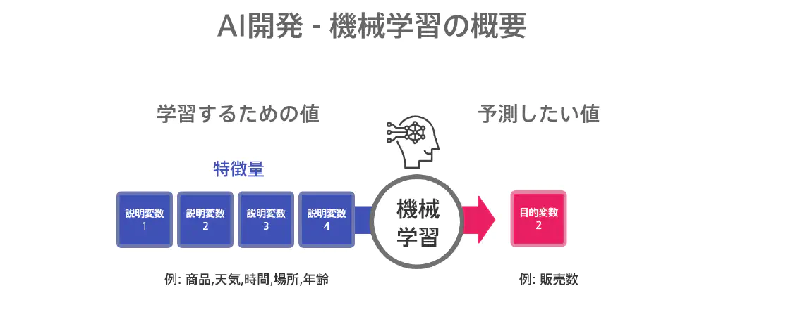

Why is “Machine Learning” getting so much attention? With the spread of smartphones, a large amount of data has started to appear. As it is, it requires a great deal of cost and time to process complicated data, but now it is possible to realize by machine learning that "calculation of analysis results with speed and accuracy that cannot be achieved by humans". It was.

**Pros of machine learning**

-Prediction value is calculated by learning features
-Select multiple reproducible models by applying multiple algorithms
-Clustering classifies features to improve prediction accuracy

**Cons**

-A certain amount of teacher data is required (at least 100 data for each classification)
-Retraining required to improve model accuracy

We use an **open source AI development framework ML.NET** to quickly model machine learning. Please contact our professionals to understand your current situation and plan a plan.

### Case

**Industry**: Securities industry

**Request**: I want to calculate the original fair value of the stock price

**Solution**: We decided to acquire financial information of listed companies including the past from EDINET and use them as teacher data. By applying basic statistics and clustering, we analyzed the correlation between feature quantity and stock price with a coarse granularity, and created a desk model. We created a temporary model by multiple regression and quantification, and worked on primary accuracy improvement by converting the feature quantity and its conversion. After obtaining a certain level of evaluation from the field in terms of both theory and accuracy, we selected an algorithm for production modeling and finally created a model for each cluster. They have succeeded in calculating the fair value from their own perspective and are using it for investment decisions.

## Contract
- Planning and design: Semi-delegation contract
- Production: Contract contract

## Deliverables

**Basic set**

- Understanding the current situation and understanding your solution
- Goal design, milestone formulation
- Requirements definition document
- Basic design document creation
- Prototype/POC creation
- Conducting a review meeting

**design**

- AI modeling
- Precision and accuracy management

**As your IT team**

- AI consultant
- SI consultant
- ML.NET engineer
- C#/JavaScript programmer

**Operation**

- System usage analysis
- Planning of improvement measures
- Support Desk
- Functional description for administrators