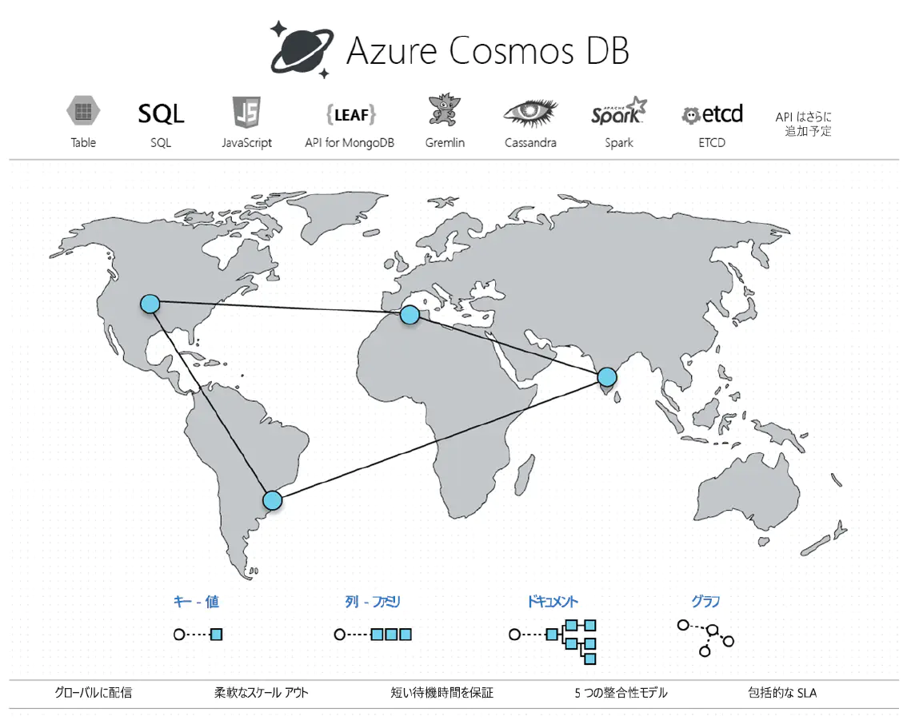

なぜ「データベース最適化」が重要なのでしょうか。大量のデータを保持しながら、リアルタイムに分析を行うなど、指数関数的に増加するデータを扱うために、従来の RDB を補完する形で NOSQL を利用する企業が増えています。

これまでは RDBMS と呼ばれるデータベースを使ってきましたが、内部のデータ構造が正規化されており、一つの画面を表示するのに、いくつものマスターテーブルを参照する必要がありました。

一方 NOSQL と呼ばれるデータベースを使うと、必要な情報を一発で取り出せるよう設計ができ、サーバーの台数追加によりデータ量やトラフィックの増大に柔軟に対応できるようになります。

**NOSQL のメリット**

- アプリケーションに最適化されたデータ格納形式をとれる
- データ型を定義せずデータを格納できる
- サーバーの台数追加で、簡単に性能の向上ができる

**デメリット**

- データの整合性を設計で考慮する必要がある

当社では**Azure Cosmos データベース**を活用して、速やかにデータベース最適化を進めます。貴社の現状の理解から企画の立案については、当社のプロフェッショナルへご相談ください。

### 事例

**業種**：自動車製造業

**概要**：IoT 端末からの生データを、大容量データベース Azure Table Storage へ格納。ユーザーが情報を見るために、Azure Function の定期起動により、データを集計と加工して、表示に最適化された Json データを作成しました。コストと性能の両立をしたデータの保管システムを実現しました。

### 期間

- 随時

### 契約

- 計画立案および設計：準委任契約
- 製作：請負契約

### 納品物

**基本セット**

- 現状把握と貴社ソリューションの理解
- ゴール設計、マイルストーン策定
- 要件定義書作成
- 基本設計書作成
- プロトタイプ/POC 作成
- レビューミーティングの実施

**設計**

- コンテンツ配置設計
- ナビゲーション設計
- パフォーマンス設計
- キャッシュ設計

**貴社の IT チームとして**

- AMP スペシャリスト
- HTML/CSS コーダー

**運用**

- システム利用状況の分析
- 改善施策の立案
- サポートデスク
- 管理者向け機能説明