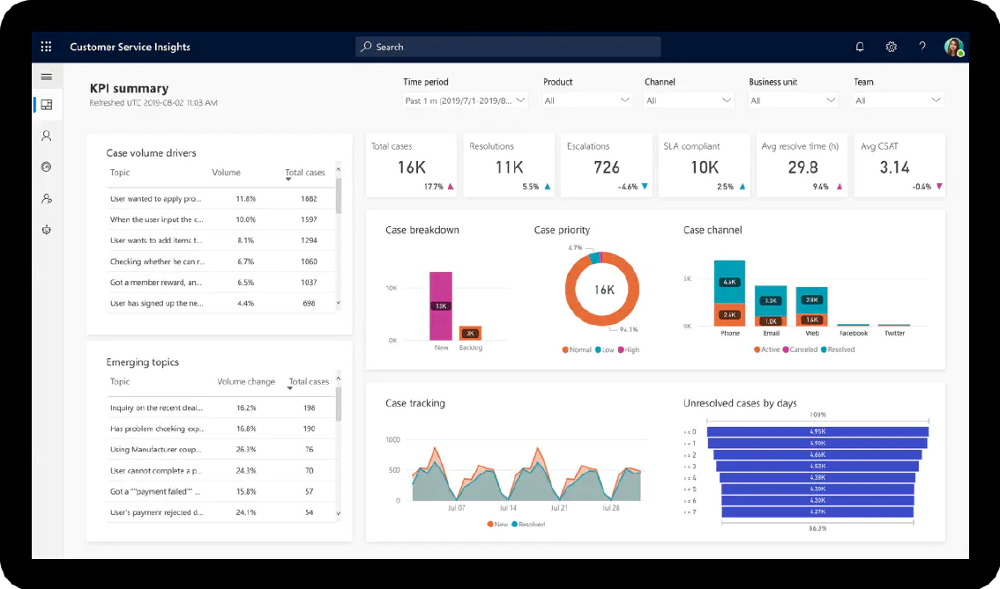

なぜ「顧客関係管理」が注目されているのでしょうか。新規開拓をし続けることも重要ですが、現在の顧客をさらに手厚くケアして、全体かつ長期的な売り上げアップを目指す時代といわれています。そのためには、接触履歴を残し、顧客との関係を情報管理するシステムが必要だからです。

### CRM の目的

- 新規顧客を増やす
- 既存顧客からのリピート率を上げる
- サービス単価を上げる
- コストを下げる

顧客関係管理システムは、見込客、営業、アフターサービスの情報を一元管理することが可能なため、貴社のビジネスに合わせて、柔軟にカスタマイズすることができます。

当社では、**顧客関係管理システム Dynamics 365**により、、速やかにシステムを立ち上げます。貴社の現状の理解から企画の立案については、当社のプロフェッショナルへご相談ください。

### 事例

**業種**：中堅サービス業

**ライセンス数**：700

**要望**：Salesforce を利用しているが、ライセンス料の比率が高く システムを最適化するための保守費が捻出できない

**ソリューション**：ライセンス料とガバナ制限にお悩みのユーザー様でした。Office 365 E3 がすでに導入されていたこともあり、Dynamics 365 と一部スクラッチアプリケーションのご提案しました。データ移行については、Salesforce からのリアルタイムデータ移行パイプラインを設置し、3 か月間の並行稼働期間を設定しました。その間、Salesforce からはデータ登録、Dynamics 側ではデータ参照を、同一データを使って 2 つの CRM を並行して運用しました。Dynamics 側にて業務上問題がないことを現場に確認いただき、切り替え日を設けて、Dynamics へのスムーズな移行を実現しました。

**補足事項**：このケースでの Salesforce ライセンス料が高いのは理由があって、絶対的にDynamicsが優れているという意味ではありません。

### 期間

- 随時

### 契約

- 計画立案および設計：準委任契約
- 製作：請負契約

### 納品物

**基本セット**

- 現状把握と貴社ソリューションの理解
- ゴール設計、マイルストーン策定
- 要件定義書作成
- 基本設計書作成
- プロトタイプ/POC 作成
- レビューミーティングの実施

**設計**

- CRM 設計
- フィット&ギャップ
- セキュリティ設計

**貴社の IT チームとして**

- CRM コンサルタント
- Dynamics 365 エンジニア
- C#/JavaScript プログラマー

**運用**

- システム利用状況の分析
- 改善施策の立案
- サポートデスク （電話・チャット）
- 管理者向け機能説明