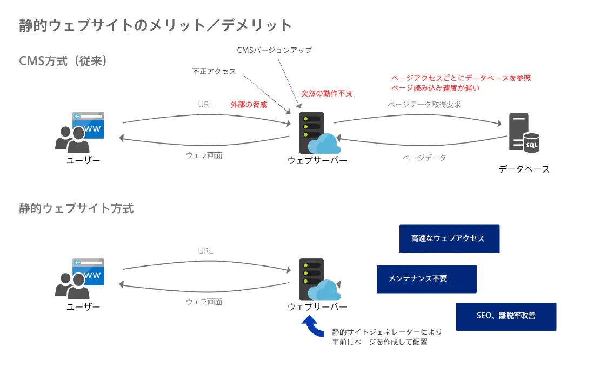

# HUGO WEB

## 安心のセキュリティでページの読み込みが早い「静的WEBサイト開発」



### 概要

WEBページの表示速度を高めたい、セキュリティ対策を盤石にしたい、リアルタイムで情報を更新するページではない…。そういった特徴を持つWEBサイトには「静的WEBサイト」の開発が有用です。今、静的WEBサイトが注目されている理由として、大きく3つが挙げられます。



### 導入の効果

#### (1) 安心のセキュリティ

CMS（コンテンツマネジメントシステム＝専門知識がなくてもWEBコンテンツを更新できるシステム）のほとんどは、定期的にバージョンアップされます。バージョンアップの変更点が小さければ、大きな問題にはなりませんが、大幅なアップデートであれば注意が必要です。時にインストールしたプラグインや拡張機能との整合性がとれなくなり、サイトに不具合が発生することがあるのです。突然ページのレイアウトが崩れたり、問い合わせフォームの動作がおかしくなったりするなどのトラブルが考えられます。

#### (2) 高速なサイト制作を実現

「ページの読み込みスピードが遅い」といった問題は、CMSが動的にページを生成するという仕組み上、なかなか避けることはできません。また、とりあえずWEBサイトを置くのであれば、ここは問題にはならないでしょう。しかし、WEBサイトを通じてブランディングやSEOを目指したい場合は、サイトの流入数や離脱率を少しでも良くするために、少しでも高速なサイト制作をおすすめします。

#### (3) メンテナンスがしやすい

CMS を導入した場合「定期メンテナンス」の費用を見込む必要があります。CMS のバージョンアップに伴う互換性チェックや、不具合対応、バックアップ、サーバー側のアップデート対応が必要となるからです。「バージョンアップはしない」という乱暴な考え方もありますが、セキュリティホールが空きっぱなしになり、問題があります。静的サイトは、サーバー側の作りがシンプルになり、メンテナンスやシステムの拡張も比較的簡単です。



### おすすめの業界・業種

- 各業種のコーポレートサイト
- 各業種の求人WEBページ
- 企業広告などのランディングページ（LP）



### 静的WEBサイトのメリット・デメリット



### 静的WEBサイトと動的CMSの違い

| 項目             | 静的         | 動的 CMS       |
| ---------------- | ------------ | -------------- |
| パフォーマンス   | 良い         | 中〜高         |
| セキュリティ     | 非常に良い   | 中〜低         |
| インフラ         | 単純         | より複雑       |
| バックアップ     | 容易         | より難しい     |
| データ駆動化     | できない       | できる           |
| コンテンツ更新   | ファイル単位 | レコード単位   |
| デザイン         | 自由         | テーマによる   |
| バージョンアップ | 任意         | 継続的かつ脆弱 |

アンダーズでは、静的サイトジェネレーター HUGOにて、速やかに静的ウェブサイトを構築します。お客様の現状を深く理解し、改善策をご提案しますので、お気軽に当社へご相談ください。



### 導入事例

**サイト**：アンダーズコーポレートサイト  

**課題**：当社はかつてFrontPageやIBMホームページビルダー、DreamWeaver など、様々なシステムを利用して、WEBサイトを構築してきました。その後、WordPressを採用したところ、本体とプラグインのバージョンアップによって不具合が発生。セキュリティ脆弱性の観点でも不安があり、頭を悩ませていました。   

**ソリューション**：データベースを必要としないサイトであれば、「静的サイトジェネレーター」で十分です。ただ、Azure Static Web Appsがリリースされたことを契機に、静的コードジェネレーターへ移行することを決定して「シンプルな開発環境」「早く構築できる」「管理が楽」なツールを慎重に探しました。そして Google Go 言語で開発された「Hugo」という静的サイトジェネレーターを発見し、選定。その結果、サイト運用担当の時間的・精神的な負担が減り、コンテンツ制作の生産性が高まりました。 性能：PageSpeed Insightsにて、任意の当社コーポレートサイトの URL を入力すると、Google によってパフォーマンスが高いことが確認できます。